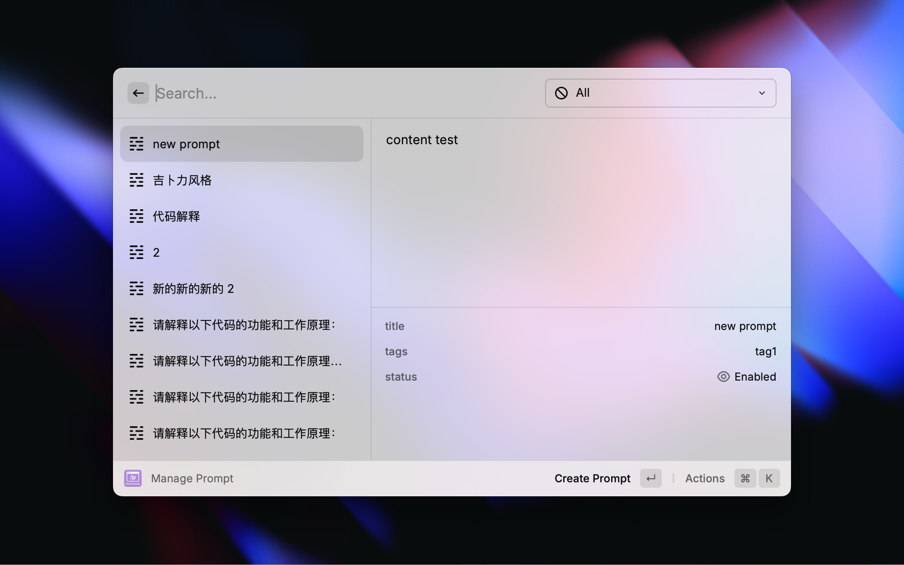
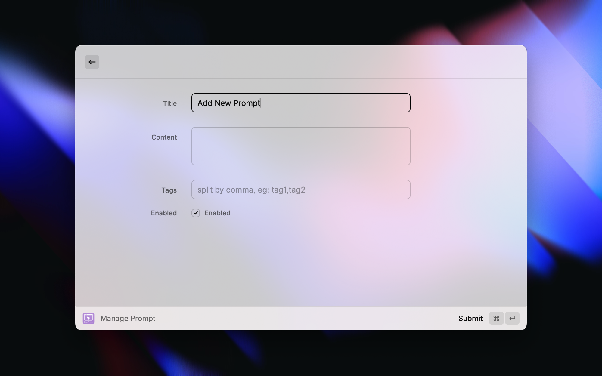
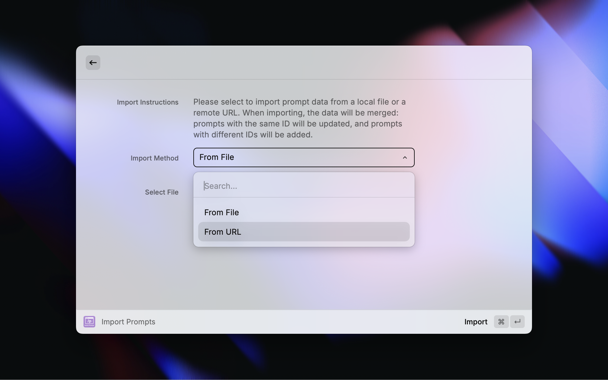

# Quick Prompt

An efficient prompt management and quick input extension for **Raycast**, integrating comprehensive features such as quick input, creation, editing, deletion, enabling/disabling, and supporting local file and remote URL data synchronization, making prompt management and input more convenient and efficient.

> Due to certain usage limitations of the [Quick Prompt browser extension](https://github.com/wenyuanw/quick-prompt), I developed this Raycast extension to enable quick insertion of prompts in any AI application and web page. Adhering to the concept of "manage once, use everywhere", it perfectly maintains compatibility with the browser plugin's data format, supporting seamless data migration through the same JSON structure.

## Features

- 🚀 **Quick Prompt Insertion**: Insert or copy the content of enabled prompts in any application with one click.
- 🗂️ **Prompt Management**: Support creating, editing, deleting, enabling/disabling prompts, and filtering and searching by tags and keywords.
- ✍️ **Quick Save Selected Text as Prompt**: Save currently selected text content in any application as a new prompt, facilitating knowledge accumulation and reuse.
- 📤 **Import/Export Functionality**: Support exporting prompts as JSON files and importing prompt data from local files or remote URLs, convenient for synchronization and backup across multiple devices.

## Installation

1. ~~Search for `Quick Prompt` in the Raycast Store and install, or build from source.~~

> Since there is a similar prompt management extension in the Raycast Store, it will not be listed in the store, and PRs will be made to the extension when time permits.

1. Import the build product in Raycast via `Extensions` -> `Import Extension`.

## Usage Instructions

### 1. Quick Prompt Insertion

- Trigger command: `Apply Prompt`
- Function: Displays all enabled prompts, supports searching, pasting, copying, toggling activation status, deleting, etc.

### 2. Prompt Management

- Trigger command: `Manage Prompt`
- Function: Manage all prompts (including disabled ones), supports creation, editing, deletion, toggling activation status, importing, exporting, etc.

### 3. Save Selected Text as Prompt

- Trigger command: `Save Selected Text`
- Function: Automatically captures the currently selected text in the application and quickly saves it as a new prompt.

### 4. Create/Edit Prompt

- Fields include: title, content, tags (comma-separated), enablement status.
- Supports form validation and convenient interaction.

### 5. Import/Export Prompts

- **Export function**: Export all current prompts as a JSON file saved to the desktop and automatically copied to the clipboard.
- **Import function**: Support importing prompt data from local JSON files or remote URLs, automatically merging duplicates.

## License

MIT License

## Contribution

Issues and PRs are welcome to improve functionality and experience!
